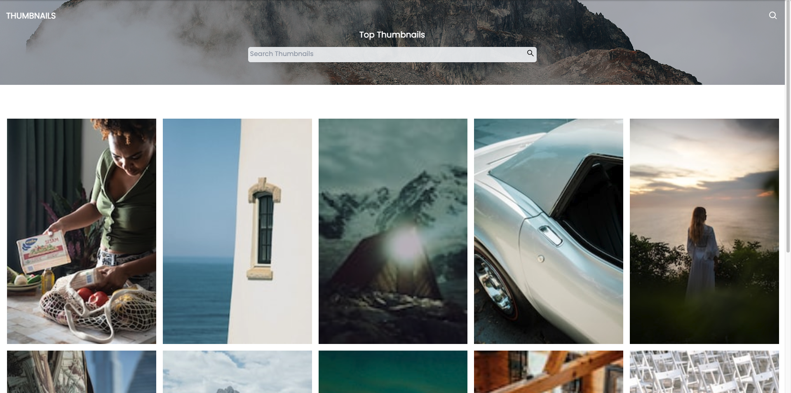
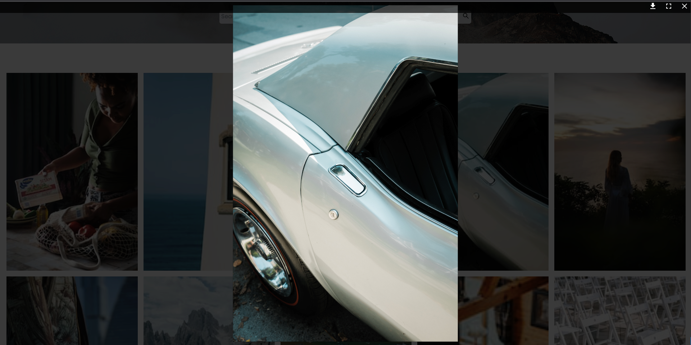
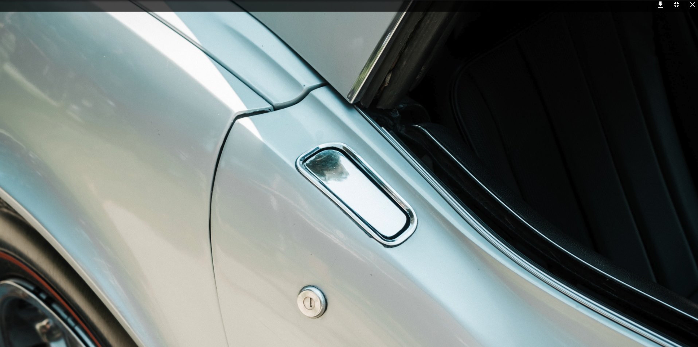

# Feature
The ability to click a thumbnail and open it fullscreen

# Screanshot

Grid :

Medium:

Large

# prerequisite

- Docker
- Disable same origin policy in Chrome
command on Mac terminal :  open -n -a "Google Chrome" --args --user-data-dir=/tmp/temp_chrome_user_data_dir http://localhost:3000/ --disable-web-security 

# Run App

docker-compose up

## Down

docker-compose down
